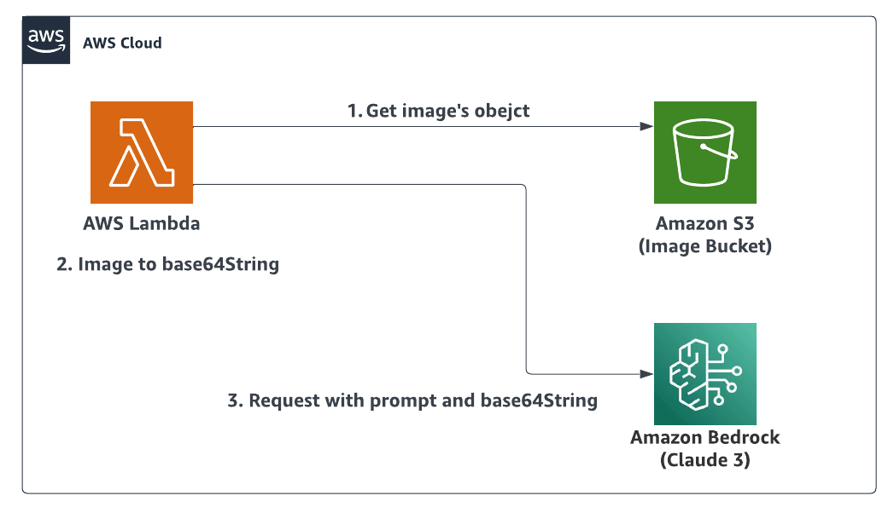
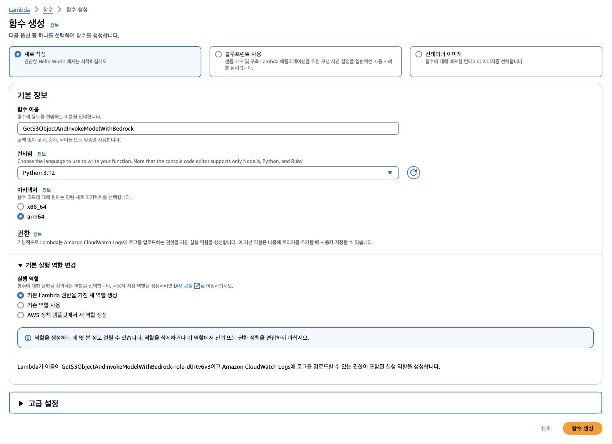
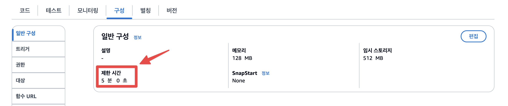
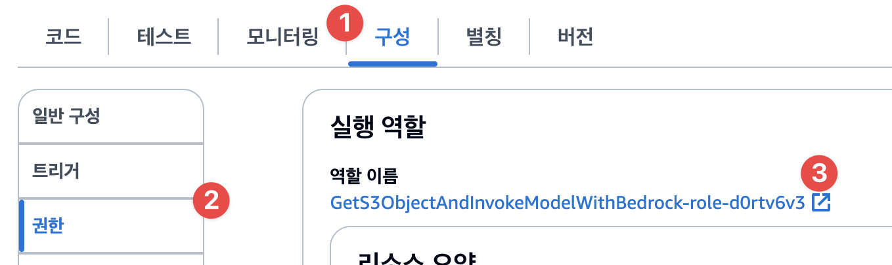
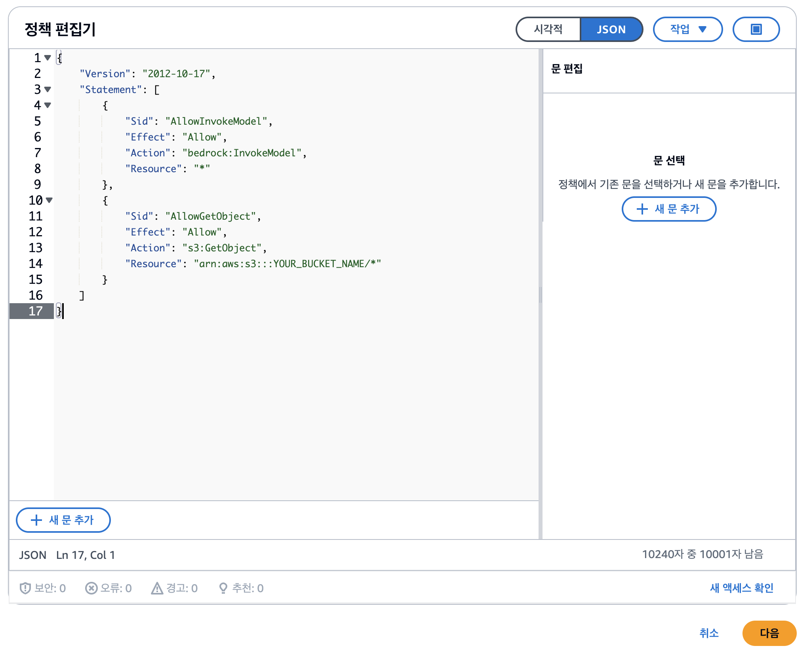
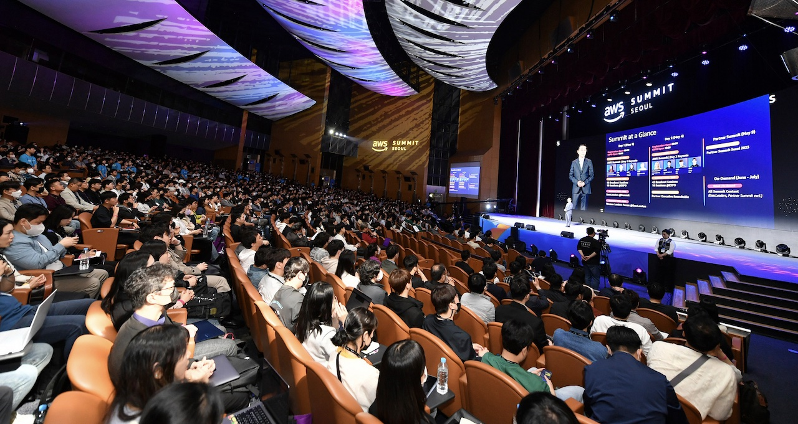

# 🖼️ Claude 3와 AWS Lambda를 이용하여 S3에 있는 이미지 분석하기

## Architecture



## Description

>현재 Amazon Bedrock에서 제공하고 있는 Claude 3 Sonnet 모델은 입력에 대해서 텍스트 뿐만아니라 이미지를 입력받아서 수행할 수 있도록 되어있습니다. 즉, 이미지와 프롬프트를 함께 주어서 이미지에 대한 작업이 가능합니다. 

>해당 가이드에서는 이를 간단히 수행할 수 있도록 AWS Lambda를 통해 Amazon S3에 저장된 이미지를 Amazon Bedrock with Claude 3를 이용하여 분석하는 가이드를 제공합니다.

>연관 이미지 처리 작업의 주요 예시로는 이미지 해석 / 이미지 민감 정보 식별 / 이미지에서 레이블 감지 등이 있습니다. 가이드 하단에 `실제 활용 예시`가 포함되어 있습니다.


## Guide

1. AWS Lambda 서비스 콘솔에서 [함수] → [함수 생성]을 선택하여 Lambda 함수를 생성합니다. 아래 스크린샷을 참고하여 설정해주시기 바랍니다.

   > 새 실행 역할에는 생성 이후, Amazon Bedrock - InvokeModel에 대한 권한, 이미지가 저장된 S3에 대하여 GetObject 할 수 있는 권한을 추가해줍니다. (아래에 가이드가 있습니다.)
   >

   

2. 람다 IDE에서 아래 코드를 복사 붙여넣기합니다.

    ```python
    import boto3
    import base64
    import json
    
    s3 = boto3.client('s3')
    bedrock_runtime = boto3.client('bedrock-runtime', region_name='us-east-1')
    
    def lambda_handler(event, context):
        # S3 버킷과 객체 키를 이벤트에서 추출
        bucket_name = event['Bucket']
        object_key = event['Key']
        prompt = event['prompt']
    
        # S3 객체 다운로드
        response = s3.get_object(Bucket=bucket_name, Key=object_key)
        image_content = response['Body'].read()
    
        # 이미지를 base64로 인코딩
        base64_encoded_image = base64.b64encode(image_content).decode('utf-8')
        
        # Bedrock 호출을 위한 Payload 작성, 원하는 결과가 나오도록 모델 파라미터를 변경할 수 있습니다.
        payload = {
            "modelId": "anthropic.claude-3-sonnet-20240229-v1:0",
            "contentType": "application/json",
            "accept": "application/json",
            "body": {
                "anthropic_version": "bedrock-2023-05-31",
                "max_tokens": 4096,
                "top_k": 250,
                "top_p": 0.999,
                "temperature": 0,
                "messages": [
                    {
                        "role": "user",
                        "content": [
                            {
                                "type": "image",
                                "source": {
                                    "type": "base64",
                                    "media_type": "image/png",
                                    "data": base64_encoded_image
                                }
                            },
                            {
                                "type": "text",
                                "text": prompt
                            }
                        ]
                    }
                ]
            }
        }
        
        # Convert the payload to bytes
        body_bytes = json.dumps(payload['body']).encode('utf-8')
        
        # Invoke the model
        response = bedrock_runtime.invoke_model(
            body=body_bytes,
            contentType=payload['contentType'],
            accept=payload['accept'],
            modelId=payload['modelId']
        )
        
        # Process the response
        response_body = json.loads(response['body'].read())
        result = response_body['content'][0]['text']
        
        # 만약, 전체 응답이 필요하다면 response_body 만 리턴되도록 해주세요.
        return result
    ```

3. [구성] 탭에서 [제한 시간]을 충분히 조정합니다. (최소 1분 이상)

   

4. [구성] 탭 좌측의 [권한] 탭에서 연결된 실행 역할을 클릭합니다.

   

    1. IAM 역할 콘솔 화면에서 [권한] 탭에서 [권한 추가] → [인라인 정책 생성]을 클릭합니다.
    2. **정책 편집기**의 우측 토글을 `JSON`으로 설정하고 스크린샷 아래의 `JSON`을 붙여넣고 `YOUR_IMAGE_BUCKET_NAME` 부분을 이미지가 업로드될 버킷명으로 변경합니다.

       

        ```json
        {
        	"Version": "2012-10-17",
        	"Statement": [
        		{
        			"Sid": "AllowInvokeModel",
        			"Effect": "Allow",
        			"Action": "bedrock:InvokeModel",
        			"Resource": "*"
        		},
        		{
        			"Sid": "AllowGetObject",
        			"Effect": "Allow",
        			"Action": "s3:GetObject",
        			"Resource": "arn:aws:s3:::YOUR_BUCKET_NAME/*"
        		}
        	]
        }
        ```

5. 적절한 정책(Policy) 이름을 입력하고 정책(Policy)을 생성합니다.
6. 다시, 람다에 연결된 역할로 돌아와 인라인 정책이 잘 설정되었는지 확인 후에 생성했던 람다 함수의 콘솔 화면으로 돌아갑니다.
7. Amazon S3 콘솔에서 권한에 지정한 S3 버킷에 이미지를 업로드하고 객체의 Key를 준비합니다.
8. [테스트] 탭에서 이벤트 이름을 입력하고 이벤트 JSON 부분에 아래 입력 값에 업로드한 **Bucket 명**, **객체 Key**, **원하는 Prompt**로 변경하여 테스트를 해봅니다.

    ```json
    {
      "prompt": "YOUR_PROMPT(e.g. 이미지를 분석해주세요.)",
      "Bucket": "YOUR_BUCKET_NAME",
      "Key": "YOUR_S3_OBJECT_KEY"
    }
    ```


---

# Example

### SAMPLE Image



### #1 이미지 해석 - SAMPLE Prompt

```json
{
    "prompt": "당신은 이미지 분석가입니다. 제공된 사진을 설명해주세요.",
    "Bucket": "YOUR_BUCKET_NAME",
    "Key": "YOUR_S3_OBJECT_KEY"
}
```

### #1 이미지 해석 - Result

“이 이미지는 AWS Summit Seoul 행사 현장을 보여주고 있습니다. 대형 강연장에 수많은 참가자들이 자리를 가득 메우고 있습니다. 대부분의 참가자들은 마스크를 착용하고 있는 모습입니다. 무대에는 발표자가 서 있고, 대형 스크린에는 AWS 관련 정보가 투영되어 있습니다. 천장에는 구름 모양의 조명이 설치되어 있어 분위기를 돋보이게 합니다. 이 행사는 AWS의 최신 서비스와 기술을 소개하고 참가자들과 정보를 공유하는 자리로 보입니다.”

### #2 이미지 민감 정보 식별 - SAMPLE Prompt

```json
{
    "prompt": "당신은 이미지 분석가입니다. 제공된 사진에는 민감한 정보를 포함하고 있는지 YES 또는 NO로 <result> 태그안에, 이유는 <reason> 태그안에 알려주세요. 설명과 이유는 필요하지 않습니다. ### 예시 ### <result>YES</result> <reason>민감한 내용이 감지되지 않았습니다.</reason>",
    "Bucket": "YOUR_BUCKET_NAME",
    "Key": "YOUR_S3_OBJECT_KEY"
}
```

### #2 이미지 민감 정보 식별 - Result

```xml
<result>YES</result>\n<reason>이미지에는 많은 사람들이 모여 있어 개인 식별이 가능할 수 있습니다.</reason>
```

### #3 이미지에서 레이블 감지 - SAMPLE Prompt

```json
{
    "prompt": "당신은 이미지 분석가입니다. 제공된 사진의 객체들에 대한 레이블 정보와 객체에 대한 위치(TopLeft, TopRight, BottomRight, BottomLeft)를 픽셀 단위로 예시 형식에 맞게 배열안에 제공해주세요. 부가적인 정보 없이 배열만 제공하세요. \n ### 예시 형식 ### \n [{label: 건물, position: {TopLeft: {x: 0, y: 100}, TopRight: {x: 100, y: 100}, BottomRight: {x: 100, y: 0}, BottomLeft: {x: 0, y: 0}}}]",
    "Bucket": "YOUR_BUCKET_NAME", 
    "Key": "YOUR_S3_OBJECT_KEY"
}
```

### #3 이미지에서 레이블 감지 - Result

```json
[
  {
    label: 'stage',
    position: {
      TopLeft: {
        x: 1200,
        y: 400
      },
      TopRight: {
        x: 1900,
        y: 400
      },
      BottomRight: {
        x: 1900,
        y: 800
      },
      BottomLeft: {
        x: 1200,
        y: 800
      }
    }
  },
  {
    label: 'audience',
    position: {
      TopLeft: {
        x: 200,
        y: 600
      },
      TopRight: {
        x: 1900,
        y: 600
      },
      BottomRight: {
        x: 1900,
        y: 900
      },
      BottomLeft: {
        x: 200,
        y: 900
      }
    }
  },
  {
    label: 'screen',
    position: {
      TopLeft: {
        x: 1300,
        y: 200
      },
      TopRight: {
        x: 1800,
        y: 200
      },
      BottomRight: {
        x: 1800,
        y: 500
      },
      BottomLeft: {
        x: 1300,
        y: 500
      }
    }
  }
]
```