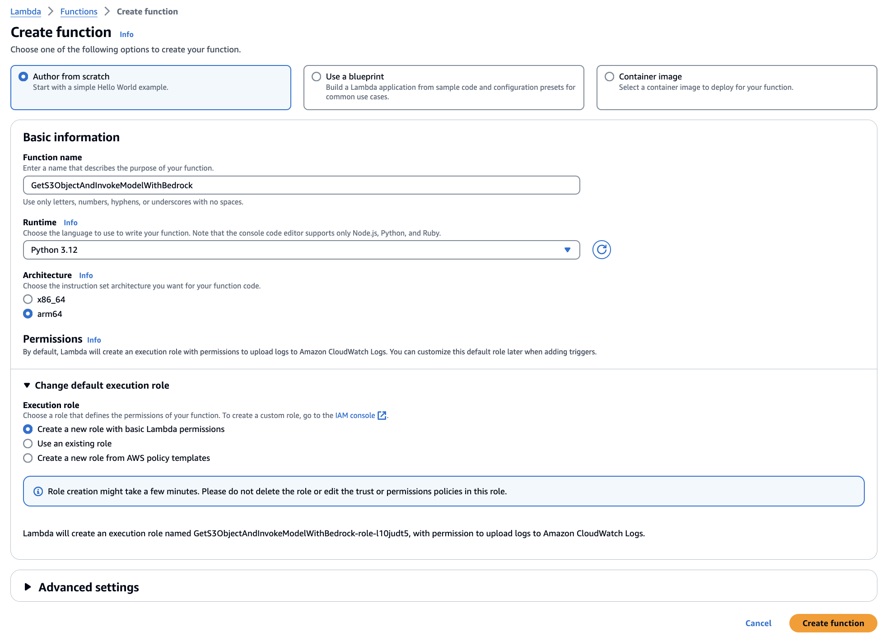
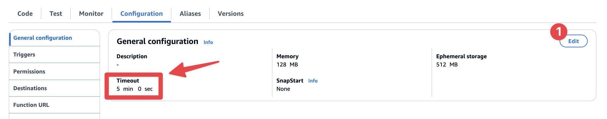
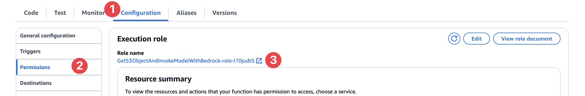
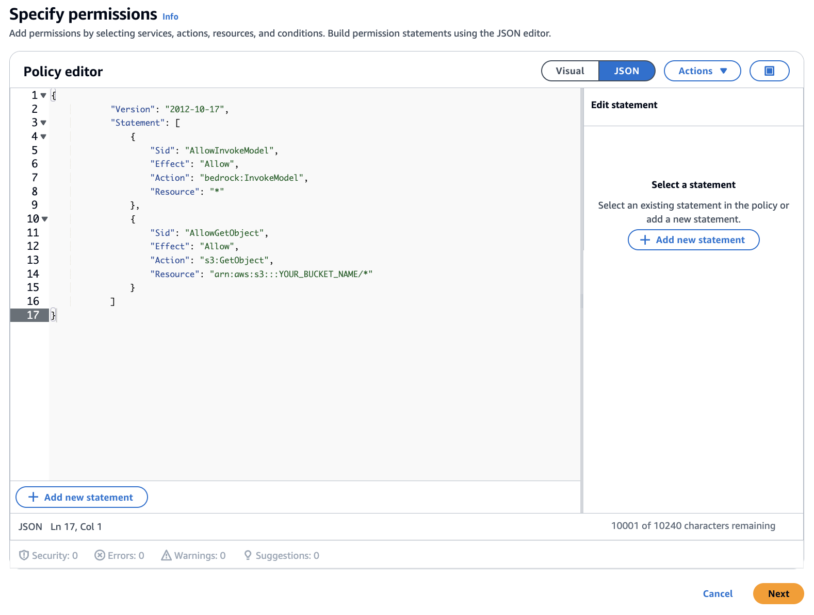
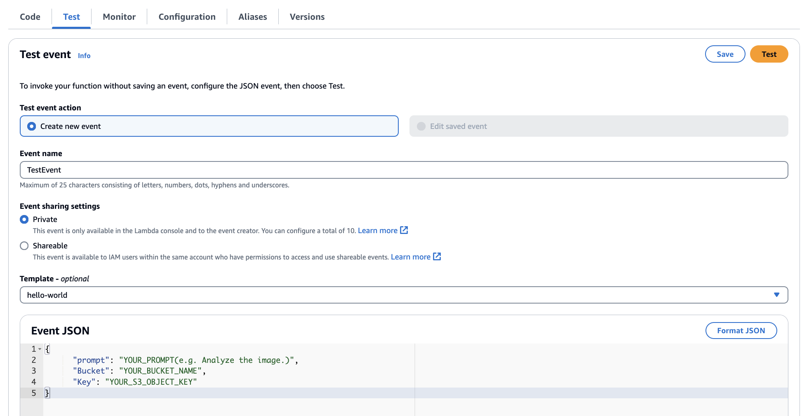

# 🖼️ Analyzing images in S3 with Claude 3 and AWS Lambda

## Architecture


## Description

>**The Claude 3 Sonnet model, currently available on Amazon Bedrock, can accept images as input as well as text, meaning that it can work with images and prompts.**

>To make this simple, this article provides a guide to analyze images stored in Amazon S3 with AWS Lambda using Amazon Bedrock with Claude 3.

>Key examples of associative image processing tasks include image interpretation / identifying image sensitive information / detecting labels in images. `Practical Examples` are included at the bottom of the guide.


## Guide

1. In the AWS Lambda Service console, select [Functions] → [Create function] to create a Lambda function. Please refer to the screenshot below to set it up.

   > After creation, the new execution role of lambda will add permissions to Amazon Bedrock - InvokeModel, and permission to Amazon S3 - GetObject where the images are stored. (There is a guide below).

   

2. In the Lambda's IDE, copy and paste the code below.

    ```python
    import boto3
    import base64
    import json
    
    s3 = boto3.client('s3')
    bedrock_runtime = boto3.client('bedrock-runtime', region_name='us-east-1')
    
    def lambda_handler(event, context):
        # Extract S3 buckets and object keys from events
        bucket_name = event['Bucket']
        object_key = event['Key']
        prompt = event['prompt']
    
        # Get Object in S3
        response = s3.get_object(Bucket=bucket_name, Key=object_key)
        image_content = response['Body'].read()
    
        # Encoding images to base64
        base64_encoded_image = base64.b64encode(image_content).decode('utf-8')
        
        # Create payloads for Bedrock Invoke, and can change model parameters to get the results you want.
        payload = {
            "modelId": "anthropic.claude-3-sonnet-20240229-v1:0",
            "contentType": "application/json",
            "accept": "application/json",
            "body": {
                "anthropic_version": "bedrock-2023-05-31",
                "max_tokens": 4096,
                "top_k": 250,
                "top_p": 0.999,
                "temperature": 0,
                "messages": [
                    {
                        "role": "user",
                        "content": [
                            {
                                "type": "image",
                                "source": {
                                    "type": "base64",
                                    "media_type": "image/png",
                                    "data": base64_encoded_image
                                }
                            },
                            {
                                "type": "text",
                                "text": prompt
                            }
                        ]
                    }
                ]
            }
        }
        
        # Convert the payload to bytes
        body_bytes = json.dumps(payload['body']).encode('utf-8')
        
        # Invoke the model
        response = bedrock_runtime.invoke_model(
            body=body_bytes,
            contentType=payload['contentType'],
            accept=payload['accept'],
            modelId=payload['modelId']
        )
        
        # Process the response
        response_body = json.loads(response['body'].read())
        result = response_body['content'][0]['text']
        
        # If you need the full response, make sure only the response_body is returned.
        return result
    ```

3. In the [Configuration] tab, adjust the [Timeout] to be long enough (at least 1 minute).

   

4. On the [Permissions] tab on the left side of the [Configuration] tab, click the associated Execution role.

   

    1. On the IAM Roles console screen, on the Permissions tab, click [Add permissions] → [Create inline policy].
    2. In the **Policy Editor**, set the right toggle to `JSON` and paste the code below the screenshot, changing the `YOUR_IMAGE_BUCKET_NAME` part to the name of the S3 bucket where the image will be uploaded.

       

        ```json
        {
        	"Version": "2012-10-17",
        	"Statement": [
        		{
        			"Sid": "AllowInvokeModel",
        			"Effect": "Allow",
        			"Action": "bedrock:InvokeModel",
        			"Resource": "*"
        		},
        		{
        			"Sid": "AllowGetObject",
        			"Effect": "Allow",
        			"Action": "s3:GetObject",
        			"Resource": "arn:aws:s3:::YOUR_BUCKET_NAME/*"
        		}
        	]
        }
        ```

5. Enter an appropriate policy name and create the policy.
6. And return to the role associated with the lambda, verify that the inline policy is set up properly, and return to the console screen of the lambda function you created.
7. In the Amazon S3 console, upload the image to the S3 bucket specified in the permissions and prepare a key for the object.
8. [테스트] 탭에서 이벤트 이름을 입력하고 이벤트 JSON 부분에 아래 입력 값에 업로드한 **Bucket 명**, **객체 Key**, **원하는 Prompt**로 변경하여 테스트를 해봅니다.
   
    ```json
    {
      "prompt": "YOUR_PROMPT(e.g. Analyze the image.)",
      "Bucket": "YOUR_BUCKET_NAME",
      "Key": "YOUR_S3_OBJECT_KEY"
    }
    ```


---

# Example

### SAMPLE Image


### #1 Interpreting image - Request

```json
{
    "prompt": "You are an image analyst. Please describe the photo provided.",
    "Bucket": "YOUR_BUCKET_NAME",
    "Key": "YOUR_S3_OBJECT_KEY"
}
```

### #1 Interpreting image - Result

"The image depicts a large conference or summit event taking place in an auditorium setting. The auditorium is filled with hundreds of attendees seated in rows, all wearing face masks, likely due to health precautions. The stage area features a large screen displaying information about the \"AWS Summit Seoul\" event, suggesting it is an event organized by Amazon Web Services (AWS) in Seoul, South Korea. The stage also has a holographic projection of a person, possibly a speaker or presenter. The auditorium has a modern design with curved ceilings and lighting elements, creating an immersive atmosphere for the event."

### #2 Identify image sensitive information - Request

```json
{
    "prompt": "You are an image analyst. Please tell us if the provided photo contains sensitive information in the <result> tag with YES or NO and why in the <reason> tag. Explanations and reasons are not required. ### Example ### <result>NO</result> <reason>No sensitive content detected.</reason>",
    "Bucket": "YOUR_BUCKET_NAME",
    "Key": "YOUR_S3_OBJECT_KEY"
}
```

### #2 Identify image sensitive information - Result

```xml
<result>NO</result> <reason>The image does not appear to contain any sensitive personal information or identities. It shows a large conference or event with many attendees seated in an auditorium, listening to a presenter on stage. While there are many people visible, no specific individuals are identifiable or named.</reason>
```

### #3 Detecting labels in image - Request

```json
{
    "prompt": "You are an image analyst. Please provide the label information for the objects in the provided photo and their positions (TopLeft, TopRight, BottomRight, BottomLeft) in pixels in an array following the example format. Provide the array without any additional information. \n ### Example format ### \n [{label: building, position: {TopLeft: {x: 0, y: 100}, TopRight: {x: 100, y: 100}, BottomRight: {x: 100, y: 0}, BottomLeft: {x: 0, y: 0}}}]",
    "Bucket": "YOUR_BUCKET_NAME", 
    "Key": "YOUR_S3_OBJECT_KEY"
}
```

### #3 Detecting labels in image - Result

```
[
  {
    label: stage,
    position: {
      TopLeft: {
        x: 1200,
        y: 400
      },
      TopRight: {
        x: 1900,
        y: 400
      },
      BottomRight: {
        x: 1900,
        y: 800
      },
      BottomLeft: {
        x: 1200,
        y: 800
      }
    }
  },
  {
    label: audience,
    position: {
      TopLeft: {
        x: 200,
        y: 600
      },
      TopRight: {
        x: 1900,
        y: 600
      },
      BottomRight: {
        x: 1900,
        y: 900
      },
      BottomLeft: {
        x: 200,
        y: 900
      }
    }
  },
  {
    label: screen,
    position: {
      TopLeft: {
        x: 1300,
        y: 100
      },
      TopRight: {
        x: 1800,
        y: 100
      },
      BottomRight: {
        x: 1800,
        y: 350
      },
      BottomLeft: {
        x: 1300,
        y: 350
      }
    }
  }
]
```